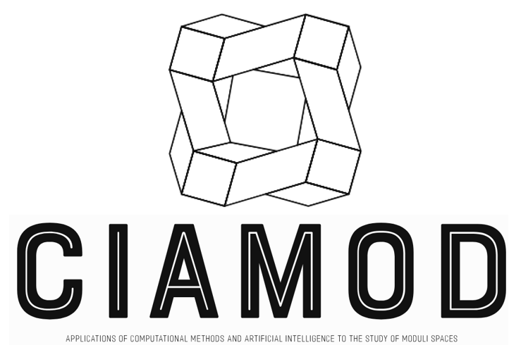

# Welcome to CIAMOD
{: width="120" }

### Applications of computational methods and artificial intelligence to the study of moduli spaces

**CIAMOD** is a research project investigating the interplay of advanced computing and AI with crucial open problems in theoretical mathematics and geometry. Below is a quick overview of our three main research paths:

---

## Research Paths

### 1. Stability Chambers
**Summary of recent progress**:  
- TODO

**Key Publications / Results**:
- TODO

[Read more about Stability Chambers →](research/stability_chambers.md)

---

### 2. Motivic Decomposition
**Summary of recent progress**:  
- TODO

**Key Publications / Results**:
- TODO

[Read more about Motivic Decomposition →](research/motivic_decomposition.md)

---

### 3. Markov Triples
**Summary of recent progress**:  
- TODO

**Key Publications / Results**:
- TODO

[Read more about Markov Triples →](research/markov_triples.md)

---

We invite you to dive deeper into each topic or explore our [Team](team.md) and [Contact](contact.md) pages for collaboration opportunities.

CIAMOD is hosted by the [Institute for Research in Technology](https://www.iit.comillas.edu/proyectos/mostrar_proyecto.php.es?nombre_abreviado=CIAMOD) and funded by Convocatoria de Financiación de Proyectos de Investigación Propios 2023, Universidad Pontificia Comillas, and by grants PID2022-142024NB-I00 and PID2019-104735RB-C42 funded by MCIN/AEI/10.13039/501100011033.